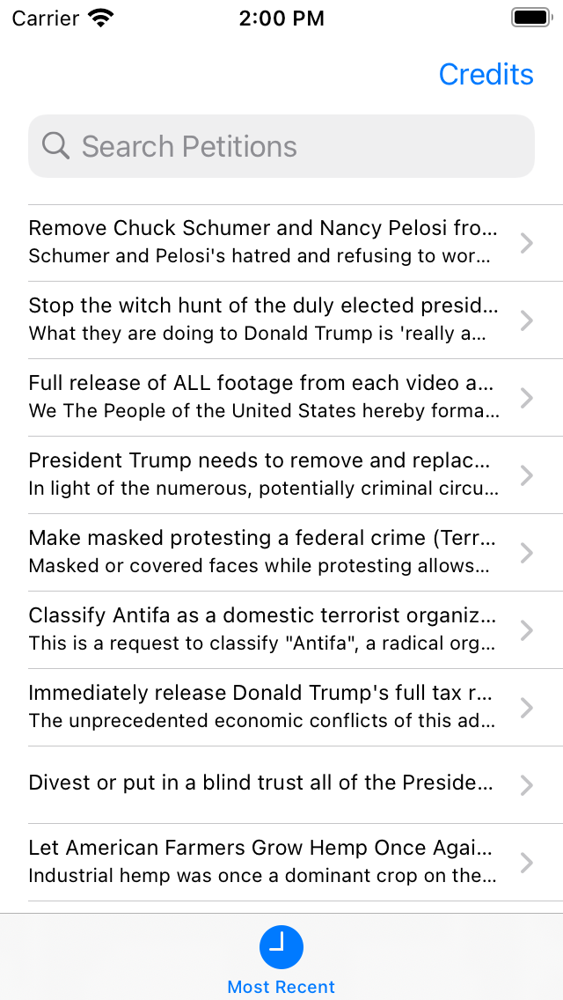

# GrandCentralDispatch (WhPetitions Implementing GCD)

> This project is about UIKit Examples and Demos based on [HackingWithSwift](https://github.com/twostraws/HackingWithSwift).

[![Swift Version][swift-image]][swift-url]
[![License][license-image]][license-url]

## Requirements

- iOS 13.2+
- Xcode 11.3.1

## Version

4.0.0

## Installation

UIKit-Series requires [iOS 11.4+](https://developer.apple.com/ios/) also requires [Xcode 11.3.1](https://developer.apple.com/xcode/) and [swift](https://developer.apple.com/swift/) to run.

Download zip file and extract it [latest release](https://github.com/reysmerwvr/UIKit-Series/GrandCentralDispatch). Or clone the repository and open it using Xcode.

Run the project.

## Screenshots

## Contribute

We would love you for the contribution to **UIKit-Series**, check the ``LICENSE`` file for more info.

## Todos

- [ ] Write tests
- [ ] Add code comments

## Meta

Reysmer Valle – [@ReysmerWVR]

## License

UIKit-Series is (c) 2021 Reysmer Valle ([@ReysmerWVR]) and may be freely distributed under the [license-url]. See the `MIT-LICENSE` file.

[swift-image]: https://img.shields.io/badge/swift-5.0-orange.svg
[swift-url]: https://swift.org/
[license-image]: https://img.shields.io/badge/License-MIT-blue.svg
[license-url]: https://github.com/reysmerwvr/UIKit-Series/tree/master/LICENSE
[travis-image]: https://img.shields.io/travis/dbader/node-datadog-metrics/master.svg?style=flat-square
[@ReysmerWVR]: <http://twitter.com/ReysmerWVR>
